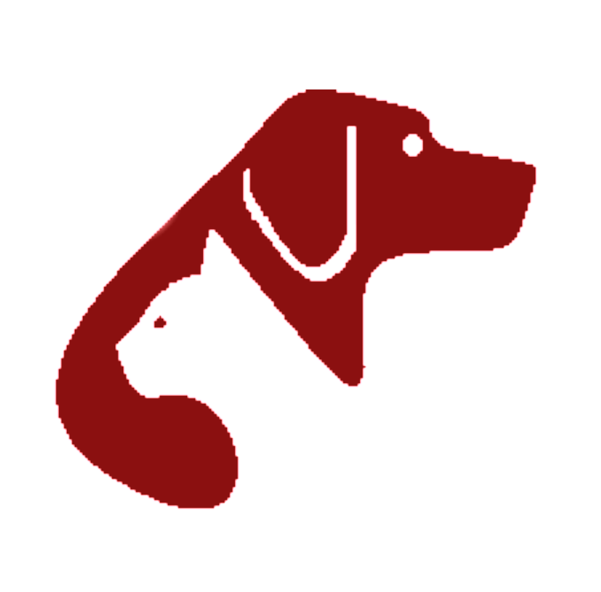

  
  

<h2 align="center">SOS Animals DZ</h2>

Save & Share note.

## Built with:

- [TypeScript](https://www.typescriptlang.org/): an open-source language which builds on JavaScript.
- [ReactJs](https://reactjs.org): an open-source, front end, JavaScript library for building smooth UI.
- [Firebase](https://firebase.google.com/): a platform developed by Google for creating mobile and web applications.s
- [Mapbx](https://www.mapbox.com/): a provider of custom online maps for websites and applications.

## Testing link: [SOS Animals DZ](https://sos-animals.vercel.app)

## Contribtion:

Feel free to open a pull requset 💁, report a bug 🐛 or request a feature 🌟 anytime you want.

## License & copyright:

© AM-77
Licensed under the [MIT License](LICENSE).

## Icons

Icons made by:

Back arrow by <a href="https://www.flaticon.com/authors/pavel-kozlov" title="Pavel Kozlov">Pavel Kozlov</a> from <a href="https://www.flaticon.com/" title="Flaticon">www.flaticon.com</a>

Eyes by <a href="https://www.flaticon.com/free-icon/hide_215488" title="Gregor Cresnar">Gregor Cresnar</a> from <a href="https://www.flaticon.com/" title="Flaticon">www.flaticon.com</a>

Bird & Dog by <a href="https://www.flaticon.com/authors/freepik" title="Freepik">Freepik</a> from <a href="https://www.flaticon.com/" title="Flaticon">www.flaticon.com</a>

Trash can by <a href="https://www.flaticon.com/authors/kiranshastry" title="Kiranshastry">Kiranshastry</a> from <a href="https://www.flaticon.com/" title="Flaticon">www.flaticon.com</a>

Check, Settings and Cancel by <a href="https://www.flaticon.com/authors/dmitri13" title="dmitri13">dmitri13</a> from <a href="https://www.flaticon.com/" title="Flaticon">www.flaticon.com</a>

Home, Hand, Shopping Cart, Chat & Pin by <a href="https://www.flaticon.com/authors/freepik" title="Freepik">Freepik</a> from <a href="https://www.flaticon.com/" title="Flaticon"> www.flaticon.com</a>

Dashboard by <a href="https://www.flaticon.com/authors/freepik" title="Freepik">Freepik</a> from <a href="https://www.flaticon.com/" title="Flaticon"> www.flaticon.com</a>

Logout by <a href="https://www.flaticon.com/authors/pixel-perfect" title="Pixel perfect">Pixel perfect</a> from <a href="https://www.flaticon.com/" title="Flaticon">www.flaticon.com</a>

Pet Care & Donation by <a href="https://www.flaticon.com/free-icon/pet-care_2138309" title="photo3idea_studio">photo3idea_studio</a> from <a href="https://www.flaticon.com/" title="Flaticon">www.flaticon.com</a>

Pawprint by <a href="http://www.freepik.com/" title="Freepik">Freepik</a> from <a href="https://www.flaticon.com/" title="Flaticon">www.flaticon.com</a>

Question Mark by <a href="https://www.flaticon.com/authors/freepik" title="Freepik">Freepik</a> from <a href="https://www.flaticon.com/" title="Flaticon">www.flaticon.com</a>

